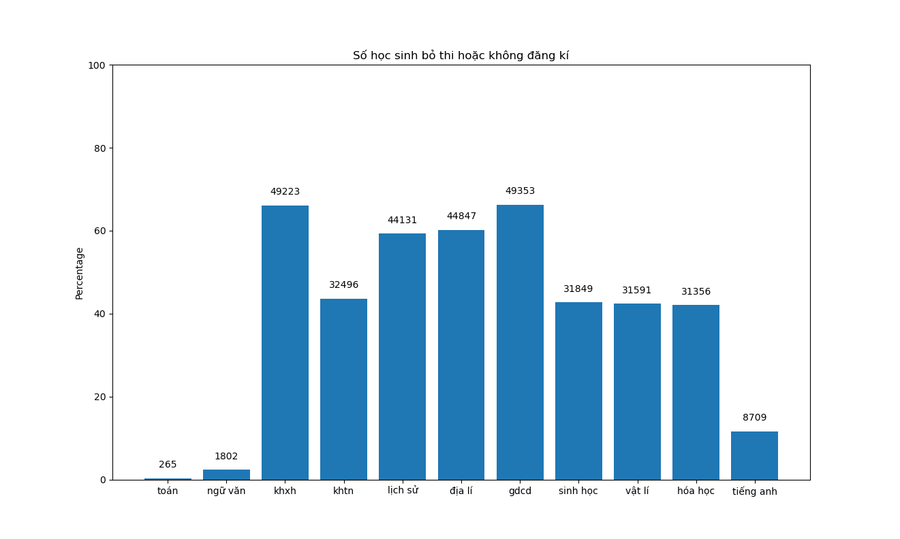
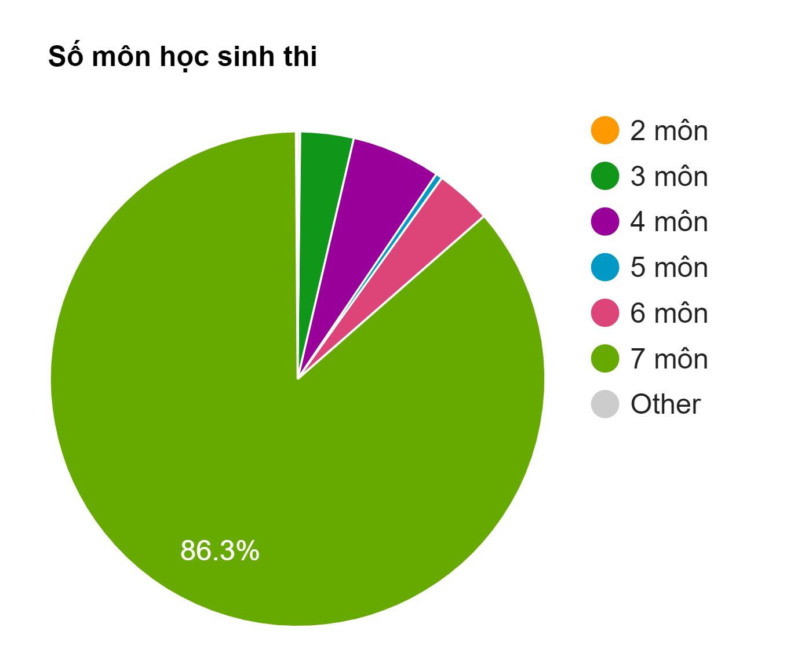
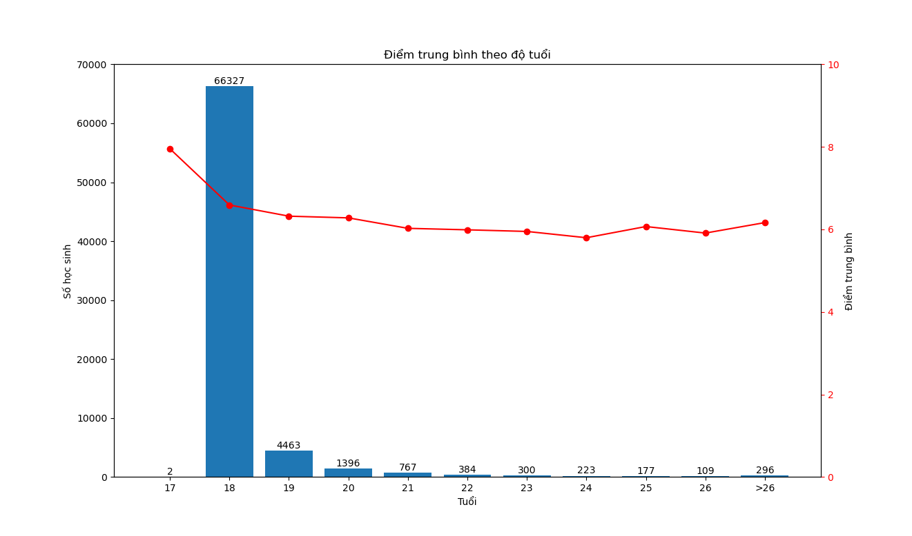

# 🏫 HCMC THPT 2020 Exam Analysis  

## 📌 Introduction  
This project analyzes the **2020 Vietnamese National High School Exam** scores in **Ho Chi Minh City**. The data was collected from **diemthi.hcm.edu.vn**, cleaned, and visualized using Python. The analysis explores trends in subject popularity, exam performance, age-based scores, and surname distribution among students.  

## 🗂 Dataset  
- **Source**: Official exam results from [diemthi.hcm.edu.vn](https://diemthi.hcm.edu.vn).  
- **Size**: Over **70,000 students** with detailed subject scores.  
- **Format**: Raw data is stored in `raw_data.txt`, cleaned data is in `clean_data.csv`.  

## ⚙️ Process Workflow  
### **1️⃣ Data Collection**  
- Used `curl` to extract data from the website.  
- Processed and stored raw data in `raw_data.txt`.  
  - 📂 Scripts: `curl-all.py`, `fileIO.py`  

### **2️⃣ Data Cleaning**  
- Removed unnecessary characters and formatting issues:  
  - Newlines, HTML tags, and whitespace (`process_1_row.py`, `delete_tag.py`, `remove_white_space_empty_line.py`).  
- Handled **Vietnamese Unicode characters** using `unicode.txt` (`29_map_unicode_to_character.py`).  
- Standardized subject scores into a structured format (`process_score.py`, `process_all.py`).  
- Final cleaned dataset: `clean_data.csv`.  

### **3️⃣ Subject Popularity Analysis**  
- Used **bar charts** to visualize the number of students per subject.  
- 📊 Findings:  
  - Some students skipped compulsory subjects like **Math and Literature**.  
  - Science subjects were more popular than social sciences.  
  - **Possible insight**: Did students skip Literature after performing poorly in Math?  
  
  📂 Scripts: `data_prepare.py`, `barchart.py`.  

### **4️⃣ Exam Subject Distribution (Pie Chart)**  
- Analyzed how many subjects students typically took.  
- **Results**:  
  - **86.3% of students took 7 subjects**.  
  - Taking **3, 4, or 6 subjects** was less common.  
  
  📂 Scripts: `data_prepare_piechart.py`, `piechart.py`.  

### **5️⃣ Average Score vs. Number of Subjects**  
- Compared average scores based on the number of subjects taken.  
- 📊 Finding:  
  - Score distribution was **fairly uniform** across different subject counts.  
  - **Initial hypothesis** (fewer subjects → lower scores) was **incorrect**.  
  
  📂 Scripts: `barchart_average_score.py`.  

### **6️⃣ Age vs. Exam Performance**  
- Checked if **older students** had lower scores.  
- Used **bar and line charts** to visualize trends.  
- 📊 Findings:  
  - Most students were **18 years old**.  
  - Very few students were **younger than 18**.  
  - Older students tended to score **slightly lower**, but the difference was minimal.  
  
  📂 Scripts: `barchart_linechart.py`.  

### **7️⃣ Most Common Surnames**  
- Extracted surname frequency and plotted a **bar chart**.  
- 📊 Findings:  
  - The surname **"Nguyễn"** was the most common, followed by **other major Vietnamese surnames**.  


📂 Scripts: `lastname_count_list.py`, `max_list.py`,`sorted_list.py`,`lastname_barchart.py`,`76_longest_name.py`.  

---

## 🚀 How to Run  
1. Clone the repository:  
   ```bash
   git clone https://github.com/your-username/your-repo-name.git
2. Install dependencies (if any).
3. Run the scripts in order:
   python curl-all.py
   python process_all.py
   python barchart.py
(Or open analysis.ipynb if using Jupyter Notebook.)
## 📬 Contact
If you have any questions, feel free to reach out via [hieungoclb02@gmail.com](https://github.com/hieungoclb02) or create an issue on this repository.
